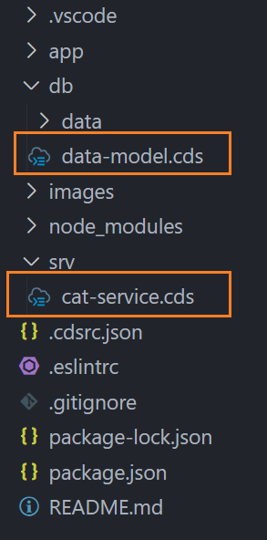
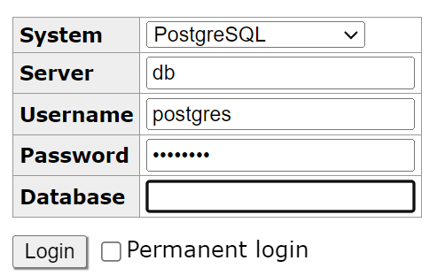

# SAP CAPM with PostgreSQL database in BTP.

We will be seeing all the steps to integrate with SAP CAPM application with PostgreSQL database in SAP BTP.

- **Step 1:** First we will be initializing the CAPM project using the cds init command. Here we have used `cds init SAP-CAPM-POSTGRES-BTP` command to generate the prostgres project and then we have added the below files to kick start the project.

        1. Schema file in the DB folder
        2. Service file in the Srv folder.

  

- **Step 2:** Then we will be creating the entity and service to expose the entity. Here we have used the below entity and srv details.

  ```javascript

  entity Books {
      key ID : Integer;
      title  : String;
      stock  : Integer;
  }

  ```

  ```javascript
  using my.bookshop as my from '../db/data-model';

  service CatalogService {
      @readonly entity Books as projection on my.Books;
  }

  ```

- **Step 3:** Now we will be adding the local PostgreSQL database using the Docker. And for that we will be installing the Docker in our system. And once it is installed we will be creating the `docker-compose.yml` and we will be adding the below portion in the yaml file.

  ```yaml
  version: "3.1"

  services:
  db:
    image: postgres:alpine
    restart: always
    environment:
    POSTGRES_PASSWORD: "postgres"
    ports:
      - "5432:5432"
  adminer:
    image: adminer
    restart: always
    ports:
      - 8080:8080
  ```

  And after that we will be using the `docker compose up` command into our root folder and we will see that our container created. And now as per our compose file the port 8080 will be used to connect to the local PostgreSQL `locahost:8080`. And the username and password is `postgres` as per the docker compose file.

  

  Once logged in then we need to create the Database called `Books` as per the entity Name.

  Now we will add the postgres to our project using `cds add postgres` command, and we will see as `"@cap-js/postgres": "^1"` added to the package.json file. Then will install it using `npm install` command.

  Now once installation is done we need to add the local PostgreSQL information to the `.cdsrc.json` file like below.

  ```json
  {
    "requires": {
      "db": {
        "kind": "postgres",
        "impl": "@cap-js/postgres",
        "credentials": {
          "host": "localhost",
          "port": 5432,
          "user": "postgres",
          "password": "postgres",
          "database": "Books"
        }
      }
    }
  }
  ```

- **Step 4:** Now we will deploy all the data in the CSV to be added to the Local postgres and to do so we will use `cds deploy` command and we will see it is deployed to the Local Postgre. and then once it is done we will get all the data deployed to the Postgre Database.

- **Step 5:** Now we will prepare for the deployment and for that first we will add the mta file using `cds add mta` command. Then we will create `pg-build.sh` and `pg-package.json` file in the root folder with below details

**pg-build.sh**:

```sh
#!/bin/bash
mkdir -p gen/pg/db
cp -r db/data gen/pg/db/
cds compile '*' > gen/pg/db/csn.json
cp pg-package.json gen/pg/package.json
cp package-lock.json gen/pg/package-lock.json
```

**pg-package.json**:

```json
{
  "engines": {
    "node": "^18"
  },
  "dependencies": {
    "@sap/cds": "*",
    "@cap-js/postgres": "^1.0.1"
  },
  "scripts": {
    "start": "cds-deploy"
  }
}
```

Now we will add the memory and disk size in the db deployer file and add the bash command in the [mta](mta.yaml) file.
